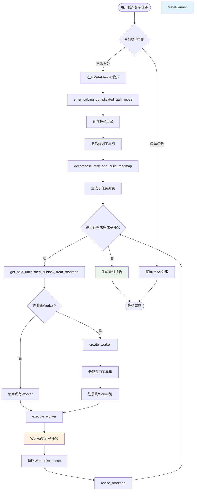
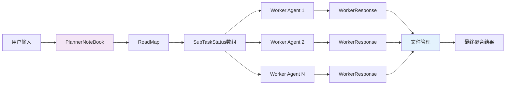

基于对MetaPlanner的深入分析，我为你绘制一个完整的流程图，并用具体例子说明工作流程：

## 🔄 MetaPlanner 完整工作流程图



## 📊 核心数据流



## 🎯 实际例子：AI发展历史研究报告

让我用一个具体例子来说明整个过程：

### 📝 任务输入
```
用户：请研究并编写一份关于AI发展历史的综合报告，包括：
1. 重要技术突破时间线
2. 关键人物及其贡献
3. 主要应用领域发展
4. 未来趋势分析
```

### 🔄 执行流程详解

#### **阶段1：任务分解**
MetaPlanner调用 [`decompose_task_and_build_roadmap`](examples/agent/meta_planner_agent/_planning_tools/_roadmap_manager.py#L23-L67) 将任务分解为：

```python
subtasks = [
    SubTaskSpecification(
        subtask_description="收集AI技术突破历史数据",
        exact_input="搜索AI发展史的重要里程碑事件",
        expected_output="按时间排序的技术突破清单",
        desired_auxiliary_tools=["tavily_search", "read_file", "write_file"]
    ),
    SubTaskSpecification(
        subtask_description="整理关键人物贡献",
        exact_input="分析AI领域重要研究人员的贡献",
        expected_output="人物贡献清单和时间线",
        desired_auxiliary_tools=["tavily_search", "write_file"]
    ),
    SubTaskSpecification(
        subtask_description="分析应用领域发展",
        exact_input="研究AI在各领域的应用发展历程",
        expected_output="应用领域发展分析报告",
        desired_auxiliary_tools=["tavily_search", "write_file"]
    ),
    SubTaskSpecification(
        subtask_description="撰写综合报告",
        exact_input="整合所有收集的信息",
        expected_output="完整的AI发展历史报告",
        desired_auxiliary_tools=["read_file", "write_file", "edit_file"]
    )
]
```

#### **阶段2：Worker创建与执行**

**Worker 1 - 历史研究员**
```python
# 调用 create_worker
history_researcher = await worker_manager.create_worker(
    worker_name="history_researcher",
    worker_system_prompt="你是AI历史研究专家，专注于收集和整理AI发展史资料",
    tool_names=["tavily_search", "write_file"],
    agent_description="专门负责收集AI历史数据"
)
```

**Worker 1 执行结果：**
```json
{
    "subtask_progress_summary": "成功收集了从1950年到2024年的AI重要突破事件，包括达特茅斯会议、深度学习革命等关键节点",
    "generated_files": {
        "ai_timeline.md": "AI技术发展时间线文档",
        "key_events.json": "关键事件数据文件"
    },
    "task_done": true
}
```

**Worker 2 - 人物分析员**
```python
# 为人物分析任务创建专门的Worker
person_analyst = await worker_manager.create_worker(
    worker_name="person_analyst", 
    worker_system_prompt="你是AI领域专家，专门研究AI领域重要人物的贡献",
    tool_names=["tavily_search", "write_file"]
)
```

**Worker 2 执行结果：**
```json
{
    "subtask_progress_summary": "完成了对图灵、麦卡锡、辛顿等20位AI领域重要人物的贡献分析",
    "generated_files": {
        "ai_pioneers.md": "AI先驱人物贡献报告",
        "researcher_timeline.json": "研究人员贡献时间线"
    },
    "task_done": true
}
```

#### **阶段3：结果聚合机制**

所有Worker的结果通过 [`execute_worker`](examples/agent/meta_planner_agent/_planning_tools/_worker_manager.py#L482-L549) 方法自动聚合：

```python
# 系统自动执行的聚合逻辑
self.planner_notebook.roadmap.decomposed_tasks[subtask_idx].workers.append(
    self.worker_pool[selected_worker_name][0]
)

# 文件验证和管理
for filepath, desc in worker_response.generated_files.items():
    if await check_file_existence(filepath, self.worker_full_toolkit):
        self.planner_notebook.files[filepath] = desc
```

**聚合后的PlannerNoteBook状态：**
```json
{
    "roadmap": {
        "original_task": "研究并编写AI发展历史报告",
        "decomposed_tasks": [
            {
                "status": "Done",
                "workers": ["history_researcher"],
                "updates": [{"task_done": true, "subtask_progress_summary": "..."}]
            },
            {
                "status": "Done", 
                "workers": ["person_analyst"],
                "updates": [{"task_done": true, "subtask_progress_summary": "..."}]
            },
            {"status": "In-process", "workers": [], "updates": []},
            {"status": "Planned", "workers": [], "updates": []}
        ]
    },
    "files": {
        "ai_timeline.md": "AI技术发展时间线文档",
        "key_events.json": "关键事件数据文件", 
        "ai_pioneers.md": "AI先驱人物贡献报告",
        "researcher_timeline.json": "研究人员贡献时间线"
    }
}
```

#### **阶段4：最终报告生成**

**Worker 3 - 报告整合员**
```python
# 创建最终的报告整合Worker
report_writer = await worker_manager.create_worker(
    worker_name="report_writer",
    worker_system_prompt="你是专业报告写作专家，负责整合多方信息生成高质量报告",
    tool_names=["read_file", "write_file", "edit_file"]
)
```

**最终输出：**
- 统一的 `AI_Development_History_Report.md`
- 包含所有子任务成果的完整报告
- 所有源文件的引用和整合

## 🔑 关键设计优势

1. **模块化分工**：每个Worker专注特定领域，提高专业性
2. **动态资源分配**：按需创建Worker，避免资源浪费  
3. **统一状态管理**：通过PlannerNoteBook集中管理所有状态和结果
4. **错误恢复**：支持任务状态保存和恢复，可中断继续执行
5. **工具优化**：每个Worker只获得完成任务必需的工具，提高效率

这种设计使得复杂任务能够被系统性地分解、执行和整合，最终产生高质量的综合结果。

想了解更多关于ReAct Agent和多Agent协作的内容，可以参考 [ReAct Agent 实现](11-react-agent-implementation) 和 [多 Agent 对话模式](13-multi-agent-conversation-patterns)。